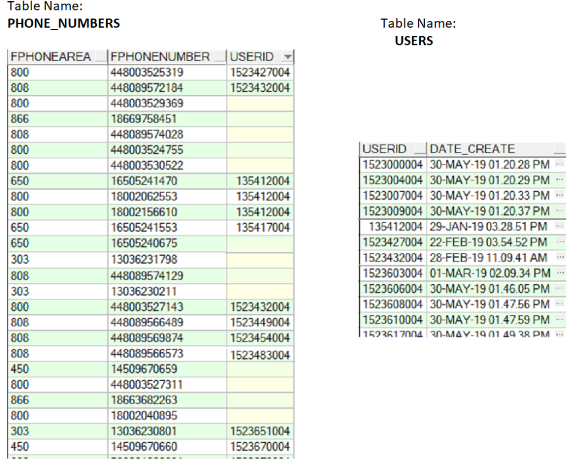

# Task 1 
## Напишите SQL запросы по таблицам:



⦁	Select all phone numbers with empty USERID`SELECT ALL FPHONENUMBER FROM PHONE_NUMBERS WHERE USERID='';
```SQL
SELECT ALL FPHONENUMBER FROM PHONE_NUMBERS WHERE USERID='';
```

⦁	Select all phone numbers for users that were created after 28 Feb
```SQL
SELECT PHONE_NUMBERS.FPHONENUMBER, PHONE_NUMBERS.USERID, USERS.DATE_CREATE
FROM PHONE_NUMBERS
JOIN USERS ON PHONE_NUMBERS.USERID = USERS.USERID
WHERE datetime(USERS.DATE_CREATE) > datetime('2019-02-28');
```

⦁	Select how many phone numbers (count) each user has.
```SQL
SELECT PHONE_NUMBERS.USERID, COUNT(FPHONENUMBER)
FROM PHONE_NUMBERS
WHERE USERID <> ''
GROUP BY USERID;
```

⦁	Select all phone numbers with FPHONEAREA is 650 and USERID is not empty
```SQL
SELECT PHONE_NUMBERS.FPHONENUMBER
FROM PHONE_NUMBERS
WHERE USERID <> '' AND FPHONEAREA = 650;
```
⦁	Change DATE_CREATE for USERID =xxxx
```SQL
UPDATE USERS
SET DATE_CREATE = 'xxxx'
WHERE USERID = 100;
```

⦁	Clear USERID for all phone numbers with FPHONEAREA is 303.
```SQL
UPDATE PHONE_NUMBERS
SET USERID = ''
WHERE FPHONEAREA = 303;
```

⦁	Insert 2 phone numbers with phone area is 800 and with empty USERID
```SQL
INSERT INTO PHONE_NUMBERS (FPHONEAREA, FPHONENUMBER, USERID)
VALUES
(800, 610610610, ''),
(800, 45341125, '')
```
<br>

# Task 2, Way 2.1
### Написать 7-10 тест-кейсов на форму заполнения заявок на стажировку на сайте DINS. https://www.dins.ru/?p=internship Важно! Тест-кейсы нужно написать на английском языке.

### <span style="color: green"> Table 1 - Set valid values for each field </span>
| **Correct values for each field** | **Input data** | **Notice** | 
| --- | --- | --- |
| input data to the field ‘**Фамилия**’ | Иванов |  | 
| input data to the field ‘**Имя**’ | Иван |  | 
| input data to the field ‘**Отчество**’ | Иванович |  | 
| input data to the field ‘**Дата рождения**’ | 01.01.1990 |  | 
| input data to the field ‘**Телефон**’ | +7(888)888-88-88 |  | 
| input data to the field ‘**Email**’ | ivan.ivanovisch@mail.foo |  | 
| input data to the field ‘**ВУЗ**’ | СПбТ |  | 
| input data to the field ‘**Курс**’ | 6 |  | 
| input data to the field ‘**Факультет**’ | Тестирования |  | 
| input data to the field ‘**Направление обучения**’ | Тестирование |  | 
| tick all 3 checkboxes ‘**Какие направления в IT тебе интересны?**’ | check-in the checkbox |  | 
| input data to the field **Какие технологии тебе интересны?**’ | Тестирование |  | 
| input data to the field **С какими технологиями работал(а) / какие изучал(а)?**’ | Тестирование |  | 
| choose a month in the drop-down list ‘**С какого месяца 2020 года сможешь начать проходить стажировку?**’ | 
Январь |  | 
| input data to the field **Сколько часов в неделю**
**ты готов стажироваться?**’ | 
40 |  | 
| accept consent to processing is personal (choose checkbox) | check-in the checkbox |  | 
| confirm your action in the reCAPTCHA checkbox | check-in the checkbox |  | 
<br>

## Case 1 - All fields are filled correctly.

| **General terms** |  | 
| --- | --- |
| 1. Opened site: [https://www.dins.ru/?p=internship](https://www.dins.ru/?p=internship)
2. All input fields are filled correctly |  | 
| **Action** | **Expected response/Condition** | 
| **Test Case** |  | 
| Click the button ‘Отправить заявку на стажировку’ | 1. site address change to ‘https://www.dins.ru/?p=internship#form-anchor’ | 
|  | 2. message appeared ‘Спасибо! Ваша заявка на стажировку отправлена.’ |
|  | 3. message appeared ‘Остались вопросы? – Пиши на jobs@dins.ru!’ |  

| **PostConditions** |  | 
| --- | --- |
| Press to ‘Назад на страницу о стажировке’ | the page ‘[https://www.dins.ru/?p=internship](https://www.dins.ru/?p=internship)’  should be opened. All input fields are empty | 
<br>

## Case 2 - All fields are empty.

| **General terms** |  | 
| --- | --- |
| 1. Opened site: [https://www.dins.ru/?p=internship](https://www.dins.ru/?p=internship)
| 2. All input fields are empty |   
| **Action** | **Expected response/Condition** | 
| **Test Case** |  | 
| Click the button ‘Отправить заявку на стажировку’ | site address change to ‘https://www.dins.ru/?p=internship#form-anchor’ | 
|  | all fields are reachable to filling | 
|  | appeared the message ‘Пожалуйста, заполните все обязательные поля’ | 
|  | all fields are marked by pink color (#fff6f6) | 
|  | the color of the sides of all fields are changed to red (#9f3a38) | 
|  | the color of all fields labels are changed to red (#9f3a38) | 
|  | * reCAPTCHA is placed on the special field with the negative event. The current test is being checked on the background field | 
<br>

## Cases 3-5 - Email validation
Notice: I selected a few cases and grouped them more compactly

| **General terms** |  |  | 
| --- | --- | --- |
| 1. Opened site: [https://www.dins.ru/?p=internship](https://www.dins.ru/?p=internship) |
| 2. The birthday field is empty| 
| 3. Other fields are filled in correctly according to table 1  |  

| **Test cases** |  |  | 
| --- | --- | --- |
| **Description** | **Test input data** | **Expected response/Condition** |  
| The double point in the domain name | ivan.ivanovisch@mail..foo | Warning message of a mistake in the email field | 
| Missing the at symbol | ivan.ivanovischmail.foo | Warning message of a mistake in the email field | 
| Missing the domain name | ivan.ivanovisch@ | Warning message of a mistake in the email field | 
<br>

## Cases 6, 7 - Birthday validation
Notice: I selected a few cases and grouped them more compactly

| **General terms** |  |  | 
| --- | --- | --- |
| 1. Opened site: [https://www.dins.ru/?p=internship](https://www.dins.ru/?p=internship)
| 2. The birthday field is empty
| 3. Other fields are filled in correctly according to table 1 |  |  | 

| **Test cases** |  |  | 
| --- | --- | --- |
| **Description** | **Test input data** | **Expected response/Condition** |  
| without a numeral | 31.10.199 | Warning message of a mistake in the phone number field |
| Mistake day input | 32.10.1995 | Warning message of a mistake in the Birthday field | 

The ideas to improve:
1. Сhange the input free data form to the drop-down list or similar form.

## Cases 8-10  -  Phone number validation
Notice: I selected a few cases and grouped them more compactly

| **General terms** |  |  | 
| --- | --- | --- |
| 1. Opened site: [https://www.dins.ru/?p=internship](https://www.dins.ru/?p=internship)
| 2. The birthday field is empty
| 3. Other fields are filled in correctly according to table 1 |  |  | 

| **Test cases** |  |  | 
| --- | --- | --- |
| Description | Test input data | Expected response/Condition | 
| Short number | ++7(999)888-77 | Warning message of a mistake in the phone number field |
| Wrong letter input | +7(999)888-77-0o | Warning message of a mistake in the phone number field | 
| Long number | +7(999)888-77-665 | Warning message of a mistake in the phone number field |